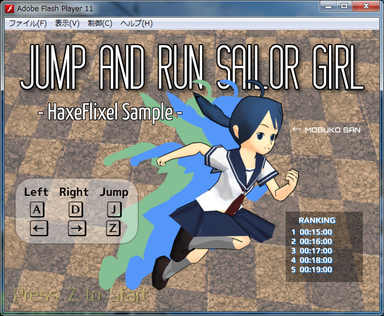
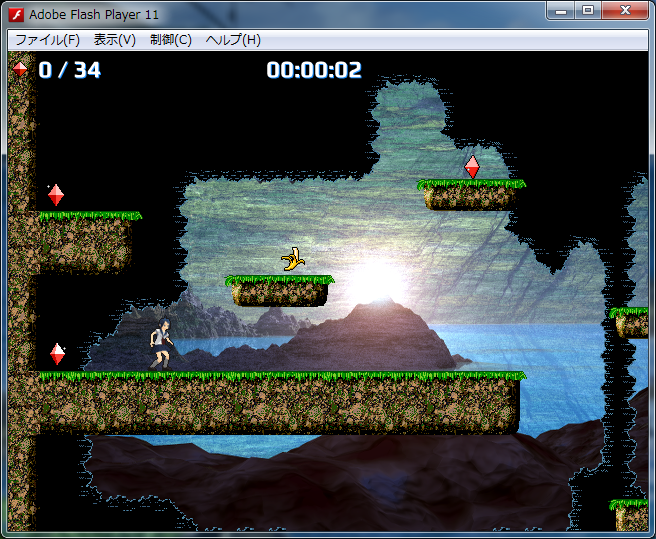

jumpandrunsailorgirl
 ====================
 
Haxe + OpenFL + HaxeFlixel で作ったサンプルゲームです。

ScreenShot
---------------

動作確認環境
--------------

* Windows 7 x64
* Haxe 3
* OpenFL (openfl 1.0.6)
* HaxeFlixel (flixel 2.0.0-alpha.3)

開発環境
--------------

* FlashDevelop 4.4.3 RTM

キャラクター画像作成には、以下のソフト・モデルデータを利用させていただきました。

* [PMCA](http://matosus304.blog106.fc2.com/blog-entry-215.html)
* [MikuMikuDance](http://www.geocities.jp/higuchuu4/)

LICENSE
------------

以下のファイルは、Public domain とします。

* source/\*.hx
* assets/images/\*.png
* assets/maps/\*
* assets/sounds/\*.(mp3|ogg|wav)

以下のファイルは、それぞれのライセンスに従います。(HaxeFlixel サンプルプロジェクト生成時のファイルそのままのため。)

* assets/data/\*

以下のファイルは、SIL OPEN FONT LICENSE です。

* assets/data/Play-Bold.ttf
* assets/data/Play-Regular.ttf

[Free Font Play by Jonas Hecksher | Font Squirrel](http://www.fontsquirrel.com/fonts/play)

更新履歴
----------------

* 2013/09/16 とりあえず、そこそこ完成。

 